# AWS 3-Tier Production Architecture Infrastructure as Code (IaC) with Terraform

[](https://www.terraform.io/)
[](https://aws.amazon.com/)
[](LICENSE)

An automated, production-ready **3-Tier Web Architecture** deployed on **Amazon Web Services (AWS)** using **Terraform (IaC)**. This repository provisions a highly available, secure, and scalable cloud environment featuring an Application Load Balancer, an Auto Scaling Group in private application subnets, and a Multi-AZ MySQL RDS database.

---

## 🌐 Live Web Application

The 3-tier architecture hosts a live, responsive developer portfolio bootstrapped automatically via EC2 `user-data`:

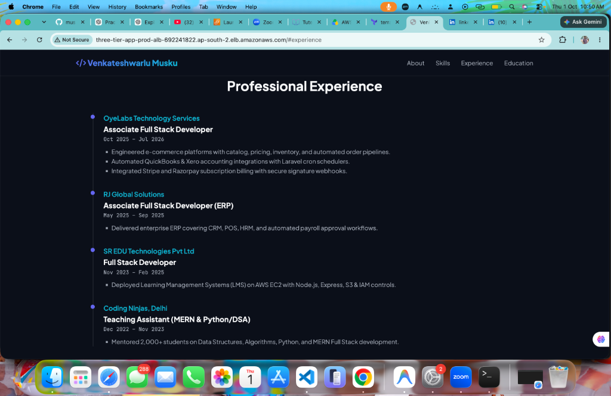

---

## 🏗 Architecture Diagram

```
                              +--------------------+
                              |  Internet / Users  |
                              +---------+----------+
                                        |
                                        v (HTTP:80)
                   +--------------------+--------------------+
                   |            Public Subnets               |
                   |      Application Load Balancer (ALB)    |
                   +--------------------+--------------------+
                                        |
                                        v (HTTP:80)
                   +--------------------+--------------------+
                   |        Private Application Subnets      |
                   |  Auto Scaling Group (EC2 / Nginx App)   |
                   +--------------------+--------------------+
                                        |
                                        v (MySQL:3306)
                   +--------------------+--------------------+
                   |         Private Database Subnets        |
                   |       Multi-AZ Amazon RDS (MySQL)       |
                   +-----------------------------------------+
```

---

## 🛠 Key Components

1. **Networking Tier (`modules/vpc`)**:
   - Dedicated VPC (`10.0.0.0/16`) across 2 Availability Zones (`ap-south-2a`, `ap-south-2b`).
   - 6 Subnets: 2 Public Subnets, 2 Private Application Subnets, 2 Private Database Subnets.
   - Internet Gateway for public traffic & single NAT Gateway for outbound internet access from private subnets.
   - Explicit route table associations for tier isolation.

2. **Security Tier (`modules/security-groups`)**:
   - **ALB Security Group**: Accepts HTTP/HTTPS traffic from `0.0.0.0/0`.
   - **App Security Group**: Restricts ingress to port 80 **only** from the ALB Security Group.
   - **DB Security Group**: Restricts ingress to port 3306 **only** from the App Security Group.

3. **IAM Tier (`modules/iam`)**:
   - EC2 IAM Role attached with `AmazonSSMManagedInstanceCore` policy for AWS Systems Manager (SSM) Session Manager access (no SSH key management required).

4. **Presentation Tier (`modules/alb`)**:
   - Public-facing Application Load Balancer with HTTP Listener (Port 80) and target group health check on `/`.

5. **Application Tier (`modules/compute`)**:
   - Auto Scaling Group (ASG) and Launch Template configured with Amazon Linux 2023 AMI.
   - Bootstrapped with custom user-data script (`user-data/app-server.sh`) installing Nginx and serving a modern portfolio application.
   - `health_check_grace_period = 300` seconds to allow instance initialization.

6. **Database Tier (`modules/rds`)**:
   - Multi-AZ Amazon RDS MySQL instance (`db.t3.micro`) deployed across private database subnets with automated backups.

---

## 📁 Directory Structure

```text
.
├── environments/
│   └── prod/
│       ├── main.tf          # Main root module calling child modules
│       ├── providers.tf     # AWS Provider configuration
│       ├── versions.tf      # Terraform required version & provider constraints
│       ├── variables.tf     # Environment variables and defaults
│       ├── locals.tf        # Naming prefixes and common tags
│       └── outputs.tf       # Root outputs (ALB DNS Name, VPC ID, Subnet IDs)
├── modules/
│   ├── vpc/                 # VPC, Subnets, Gateways, Route Tables
│   ├── security-groups/     # Security Groups for ALB, EC2, and RDS
│   ├── iam/                 # EC2 IAM Roles & Instance Profiles
│   ├── alb/                 # Application Load Balancer & Target Group
│   ├── compute/             # Launch Template & Auto Scaling Group
│   └── rds/                 # DB Subnet Group & Multi-AZ RDS Instance
├── user-data/
│   └── app-server.sh        # Bootstrapping script for EC2 instances
└── docs/
    └── images/              # Execution & console verification screenshots
```

---

## 🚀 Step-by-Step Deployment Guide

### Prerequisites
- [Terraform CLI](https://developer.hashicorp.com/terraform/downloads) (>= 1.0.0)
- [AWS CLI](https://aws.amazon.com/cli/) configured with valid IAM credentials (`aws configure`)

### Step 1: Navigate to Production Environment
```bash
cd environments/prod
```

### Step 2: Initialize Terraform Modules & Providers
```bash
terraform init
```

### Step 3: Preview Execution Plan
```bash
terraform plan -var="db_password=YourStrongPassword123"
```

### Step 4: Apply & Deploy Infrastructure
```bash
terraform apply -var="db_password=YourStrongPassword123" -auto-approve
```

### Step 5: Verify Deployment
After `terraform apply` completes:
- Retrieve the ALB DNS Name outputted by Terraform:
  ```bash
  terraform output alb_dns_name
  ```
- Open the URL in your web browser:
  `http://<alb-dns-name>/`

---

## 📸 Implementation & AWS Verification Screenshots

### 1. Presentation & Compute Tier

#### Live Application Load Balancer Console
Active, Internet-facing Application Load Balancer details (`three-tier-app-prod-alb`):
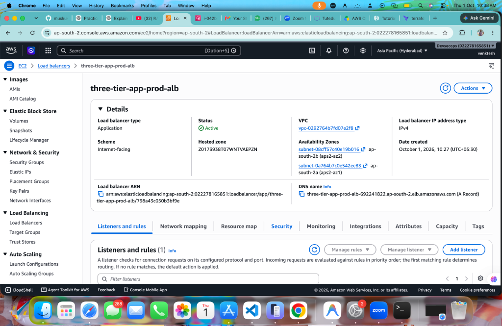

#### EC2 Launch Template Details
Version details for `three-tier-app-prod-app` Launch Template (`lt-01266f96d8b16b281`):
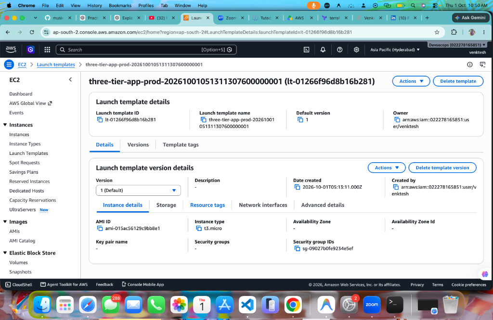

#### Auto Scaling Group Capacity
Auto Scaling Group configuration (`three-tier-app-prod-asg`) running at desired capacity across private subnets:
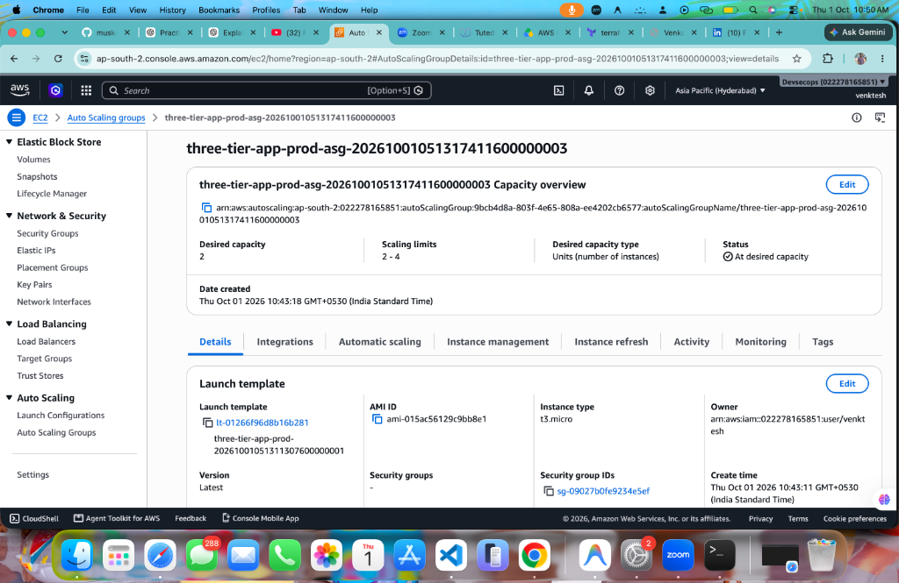

#### ALB Target Group Configuration
Target Group (`three-tier-app-prod-tg`) associated with the ALB:
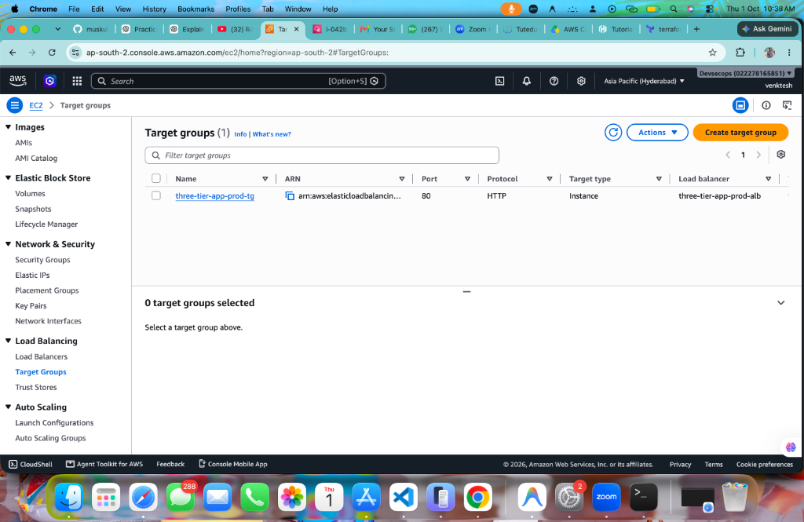

#### Target Group Health Checks
Details of the HTTP:80 Instance target group:
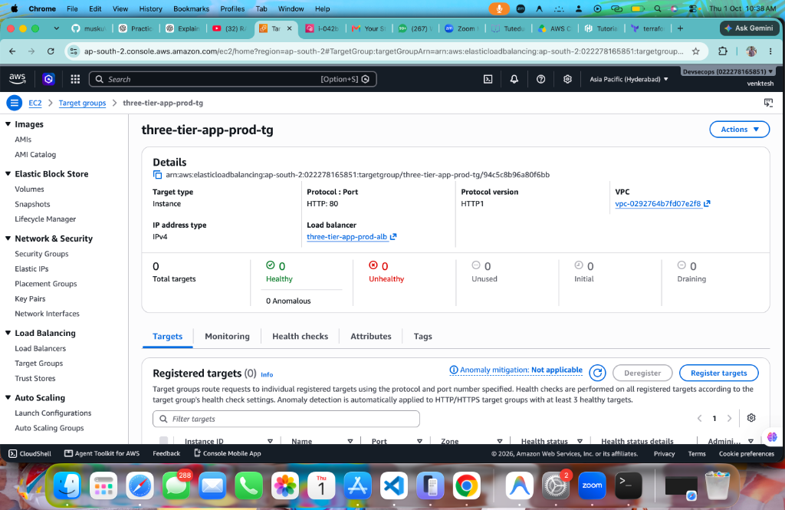

---

### 2. Database Tier (Amazon RDS MySQL)

#### Multi-AZ RDS Instance Details
Verification showing active `three-tier-app-prod-mysql` instance (`db.t3.micro`) with status **Available** and Internet Access Gateway **Disabled**:
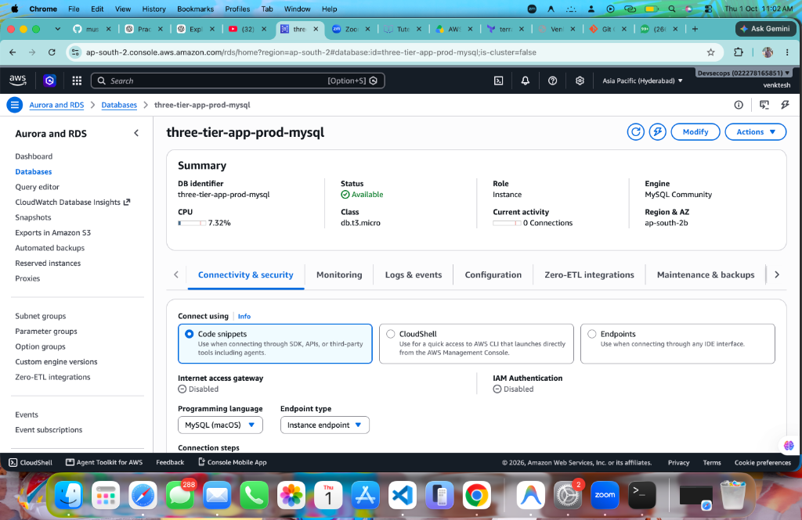

#### DB Subnet Group Configuration
Verification of `three-tier-app-prod-db-subnet-group` containing private database subnets across 2 Availability Zones (`ap-south-2a` and `ap-south-2b`):
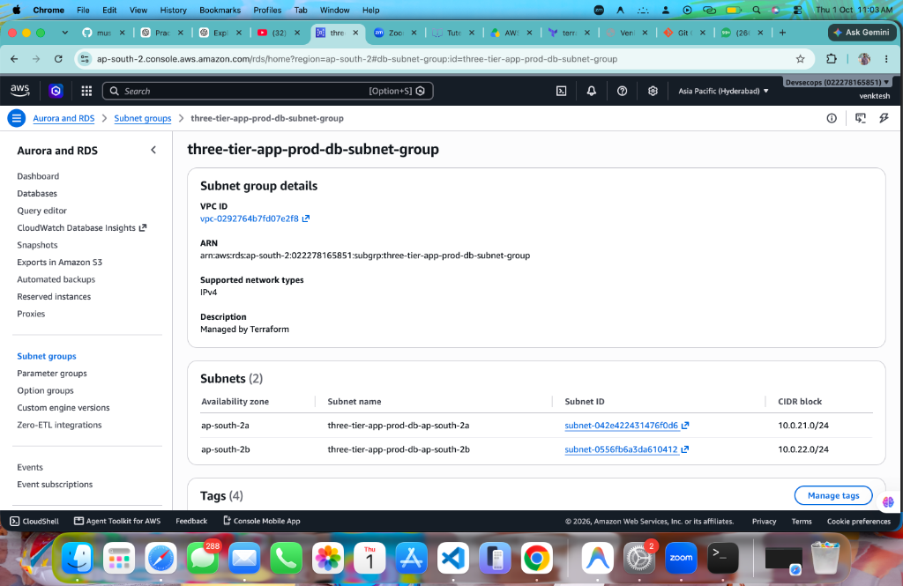

---

### 3. VPC & Networking Infrastructure

#### AWS VPC Details & Resource Map
Verification showing active `three-tier-app-prod-vpc` (`10.0.0.0/16`) in region `ap-south-2` with 6 subnets and 6 route tables:
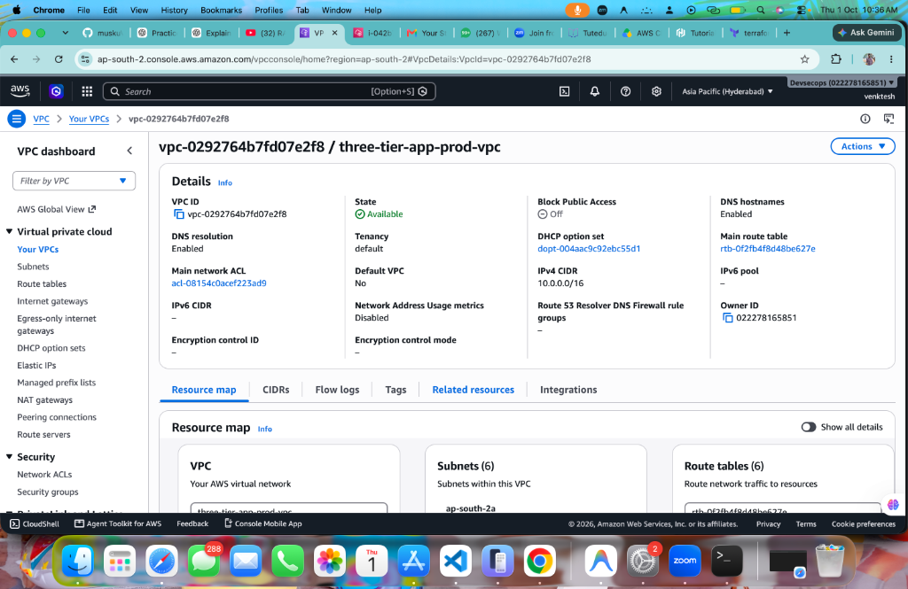

#### AWS Subnets Configuration
Verification of 6 isolated subnets across 2 Availability Zones (`ap-south-2a` & `ap-south-2b`):
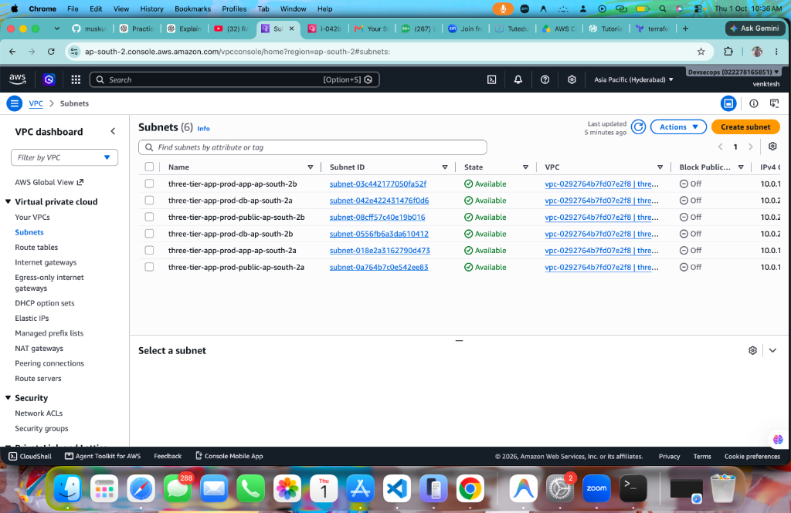

#### Internet Gateway Attachment
Verification of `three-tier-app-prod-igw` attached to the VPC:
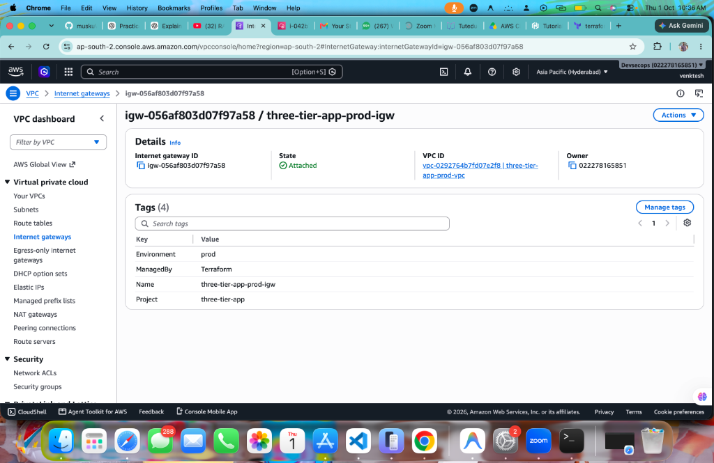

#### Route Tables & Explicit Subnet Associations
Verification of 6 Route Tables isolating Public, Application, and Database network traffic:
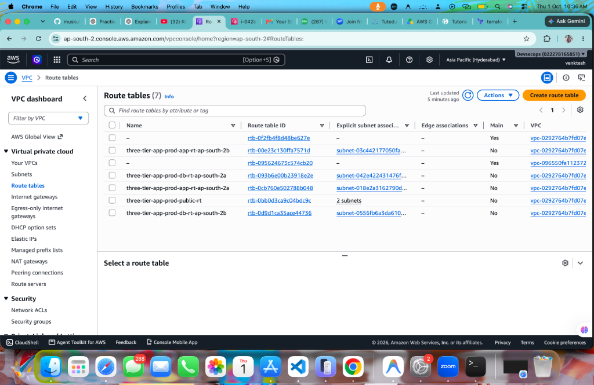

---

### 4. Security & Access Control

#### Tier-Isolated Security Groups
Verification of Security Groups for ALB (`three-tier-app-prod-alb-sg`), Application Server (`three-tier-app-prod-app-sg`), and Database (`three-tier-app-prod-db-sg`):
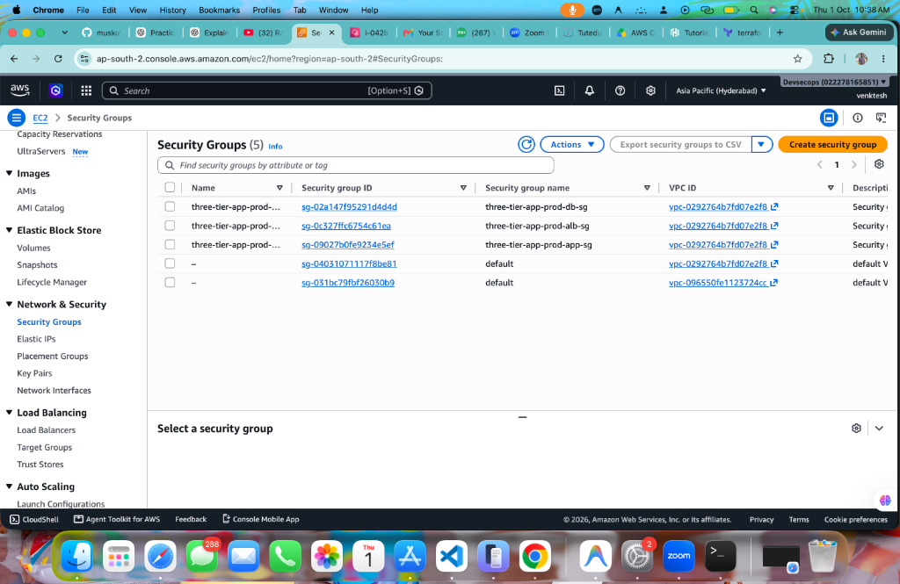

---

### 5. Terraform Execution & Validation

#### Terraform Apply Initialization
Module creation progress during initial execution:
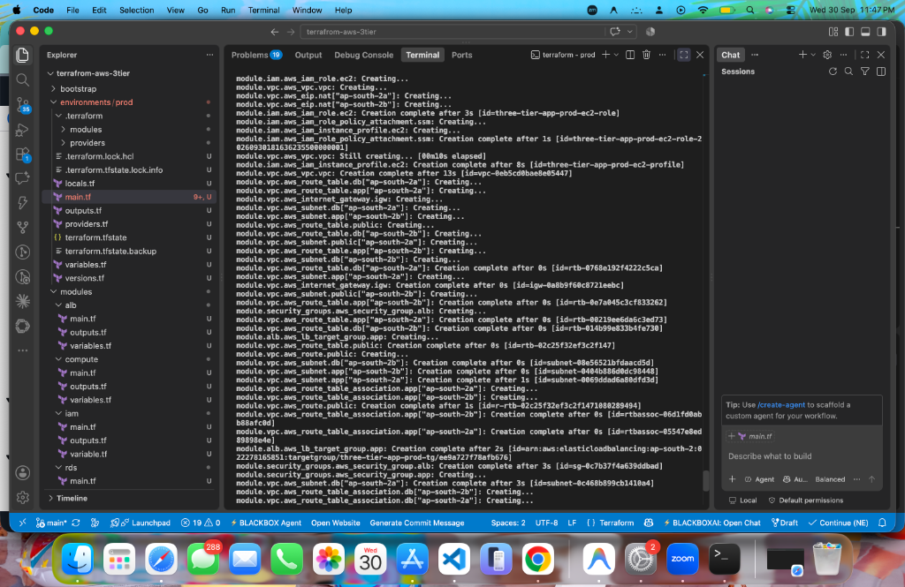

#### Terraform Apply Provisioning Progress
Parallel provisioning of ALB, Launch Template, ASG, and Multi-AZ RDS:
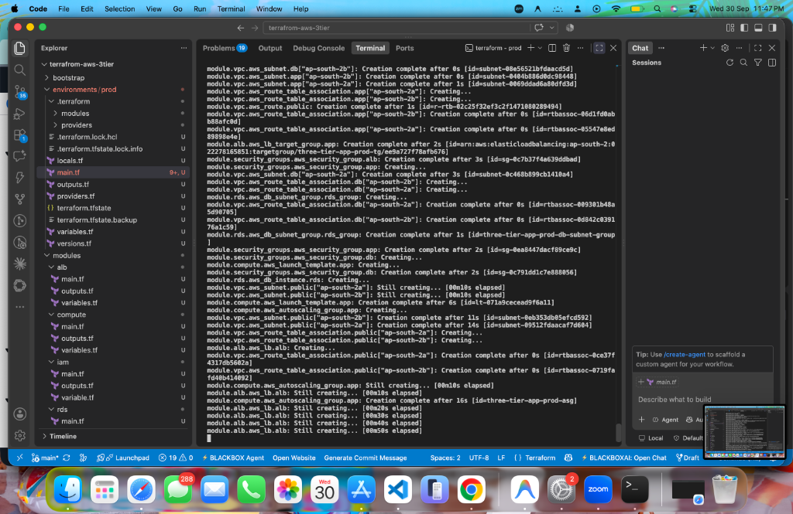

#### Code Test Coverage & Validation
Test suite validation output:
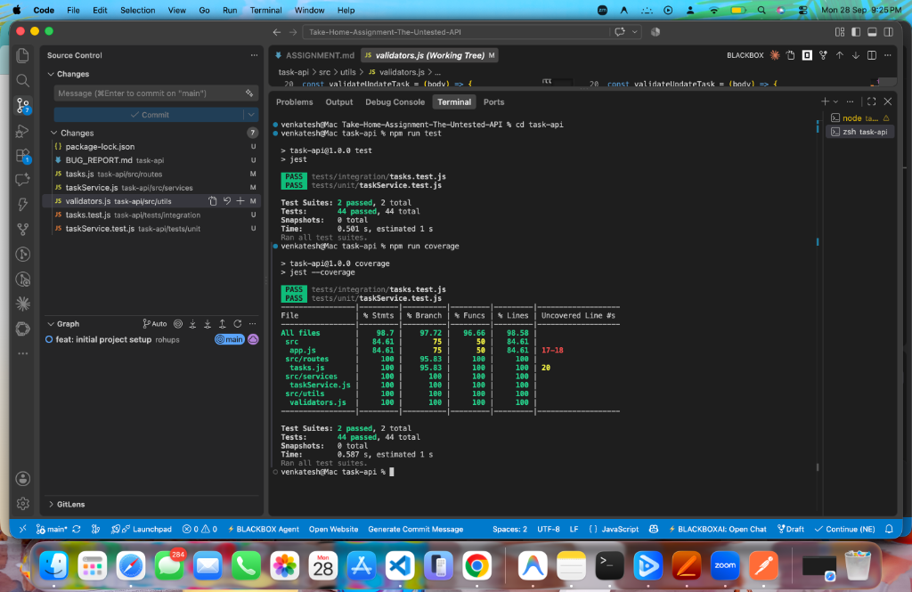

---

## 🔧 Technical Challenges & Solved Issues

| Issue Encountered | Root Cause | Solution Implemented |
| :--- | :--- | :--- |
| **`Invalid for_each argument`** | `for_each` was bound to dynamic resource objects (`aws_subnet.public`). | Updated `for_each` to iterate over static `local.public_subnets` map and looked up subnet IDs dynamically. |
| **`AddressLimitExceeded (EIP)`** | AWS Elastic IP quota reached in target region (`ap-south-2`). | Replaced multi-EIP setup with a **Single NAT Gateway** architecture and released unattached EIPs via AWS CLI. |
| **`InvalidUserData.Malformed (>16KB limit)`** | User-data script exceeded the 16KB AWS Launch Template limit. | Minified HTML/CSS portfolio code inside `user-data/app-server.sh` to <5KB. |
| **`502 Bad Gateway`** | ASG terminated instances before `cloud-init` finished installing Nginx. | Added `health_check_grace_period = 300` to ASG and added retry logic in `app-server.sh`. |

---

## 🧹 Cleanup / Destruction

To tear down all created AWS resources and avoid unexpected charges:

```bash
cd environments/prod
terraform destroy -var="db_password=YourStrongPassword123" -auto-approve
```

---

## 👨‍💻 Author

**Venkateshwarlu Musku**  
- **Email**: [venkateshmusku6@gmail.com](mailto:venkateshmusku6@gmail.com)  
- **GitHub**: [github.com/muskuVenkatesh](https://github.com/muskuVenkatesh)  
- **LinkedIn**: [linkedin.com/in/venkateshwarlu-musku](https://linkedin.com/in/venkateshwarlu-musku)
